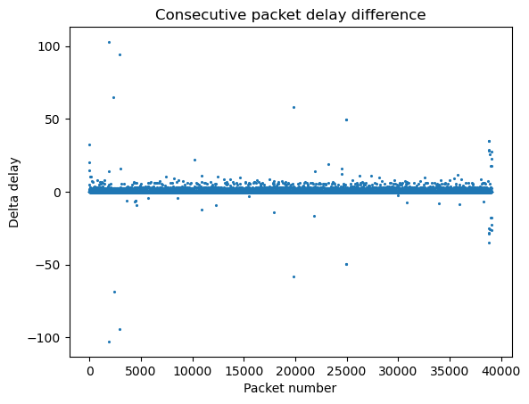
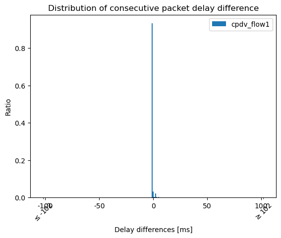

# jitter-graphs
Generate jitter (cpdv) graphs (as PDF) from pcaps of iperf2 test runs.

`cpdv_tsv.py` creates .tsv (tab separated values) files from the pcaps (this is the computation intense part). 

`cpdv_diagram.py` generates various diagrams like the following from those .tsv files.



This separation of tools is done on purpose so you can do the computation intense step only once and then try around a lot with different diagram settings if necessary.


## Dependencies

### general dependencies:

 - python3
 - iperf
 - tcpdump

### cpdv_tsv

 - scapy (python3-scapy on Debian/Ubuntu or pip3 install scapy)

### cpdv_diagram 

- matplotlib (python3-matplotlib or from pip3)
- numpy (python3-numpy or from pip3)


## Full Example Walkthrough

For this example we create a little iperf2 test run, capture it in a pcap and generate 2 diagrams from it. 
For this you need a `iperf -s` server running on some server (katze.de in this example).

First start tcpdump to listen all the traffic. port 5001 is the iperf2 port. This expression makes sure you only
capture iperf2 traffic from the right host.

`sudo tcpdump -i wlan0 -w tcp_trace.pcap  'port 5001 and host katze.de'`

Now, in another terminal, start the iperf test run. -R reverse from the host to you and with 1Mbit/s.

`iperf -c katze.de -R -b 1M `

After iperf is finished change into the tcpdump terminal and kill tcpdump with Ctrl+c. Now you can call `cpdv_tsv.py` on the pcap file.
Here in this example it lies in the parent folder to the pcap, depending where you put it that might be slightly different. This is the computation intense
part, it generates a tsv (tab separated values) file from the pcap containing the sequence numbers and timings. One .tsv file for every flow it finds 
in the pcap.

`../cpdv_tsv.py tcp tcp_trace.pcap` 

Here it finds two flows: the iperf control flow (cpdv_flow0.tsv) and the payload flow (cpdv_flow1.tsv). 
To get a point cloud diagram of the payload flow do: 

`../cpdv_diagram.py points cpdv_flow1.tsv`

Now you get the following diagram as PDF:


You can also create Jitter distribution diagrams with: 

`../cpdv_diagram.py distribution -t cpdv_flow1.tsv` 


Which look like this: 



You can provide several parameters to the distribution subcommand to control how exactly the diagram is drawn and make it better at illustrating your data. See `cpdv_diagram.py distribution -h` and the examples below for details.

This was done with my normal home internet connection and show that there is relatively little reordering. So overall the path is giving a good service to my packets. Please note that those big delay spice must not necessarily be from network delay but also because the application might have waited to send the next packet for some reason.


## Internals and technical Details

For TCP we use the TCP sequence numbers for UDP we use the sequence numbers added by iperf
in its own application layer header.

The more precise term is Packet Delay Variation (PDV) that's why the tools are called like that. Jitter is a more general term and can mean other things (https://en.wikipedia.org/wiki/Packet_delay_variation).

We make use of the fact that per default iperf sends packets regularly with a constant delay between them. So in a perfect network they would all arrive with the same time difference. By measuring the difference in arrival times we can see what different delays they experienced. This is called consecutive packet delay variation (cpdv). If iperf traffic would not have this pattern we would need synchronised clocks and timestamps.

The default output format is PDF but it is relatively easy to change in the script to png or jpeg, since matplotlib supports all those directly. It could also be a parameter one day.

## More Examples 

The cpdv tools can also work with multiple folders/pcaps/.tsv files and provide extensive help output on all their subcommands:

```
cpdv_tsv.py udp  */*.pcap

cpdv_diagram.py distribution -d OTIAS/ LowRTT/ MPTCP/ HTMT/ -l -100 100 -b 20 -c
cpdv_diagram.py distribution -d afmt_noqueue_busy_wait/ llfmt_noqueue_busy_wait/  otias_sock_drop/ srtt_min_busy_wait/

cpdv_diagram.py points cpdv_flow0.tsv
cpdv_diagram.py points -d afmt_noqueue_busy_wait/ llfmt_noqueue_busy_wait/  otias_sock_drop/ srtt_min_busy_wait

cpdv_diagram.py points -h
cpdv_diagram.py distribution -h
```

## Acknowledgements

